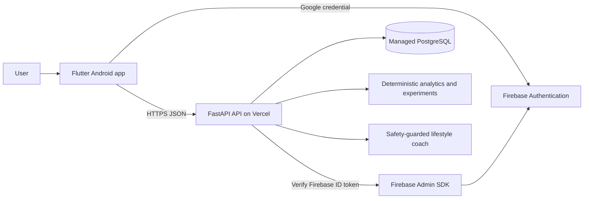
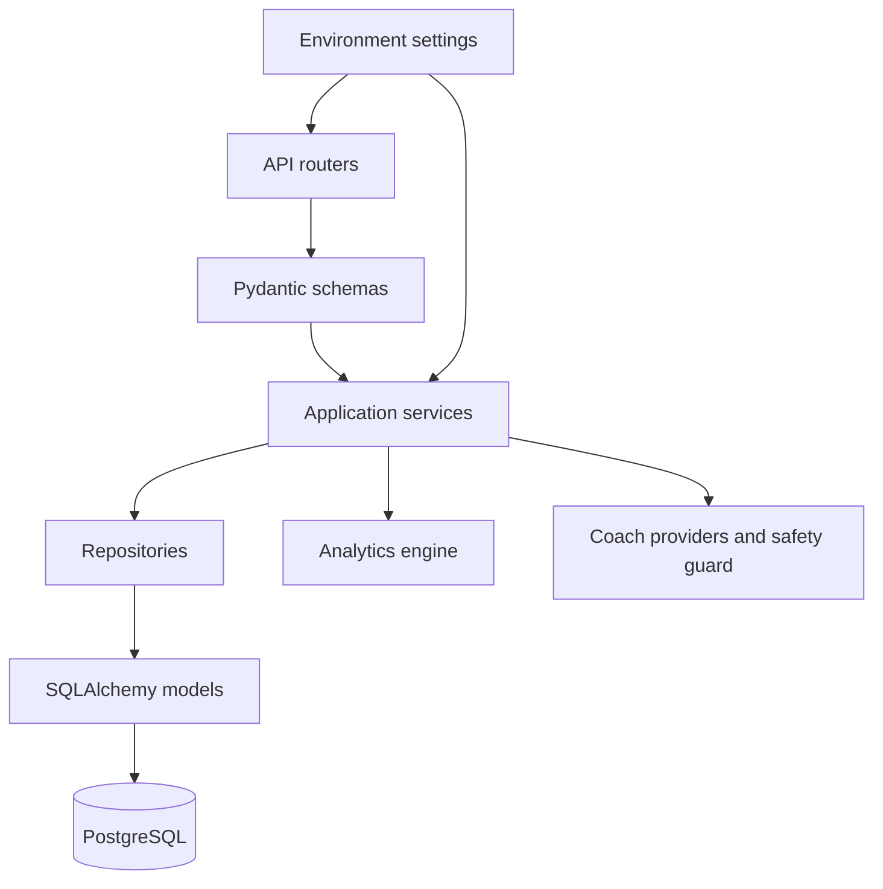

# System architecture

## Purpose

AarogyaDrishti is a privacy-first lifestyle observation system. It records
user-provided and Health Connect observations, computes personal aggregates,
and presents patterns and experiments. It does not diagnose disease, prescribe
treatment, predict disease risk, or claim causation.

## Context diagram

## Backend layers

- **API layer:** authentication, profile, daily logs, dashboard, consent,
  experiments, learning, coach, and health routes.
- **Service layer:** business rules, token issuance, baseline computation,
  experiment evaluation, and coach orchestration.
- **Repository/model layer:** database access and user-scoped persistence.
- **Analytics layer:** deterministic baselines, adherence, consistency,
  evidence, insights, and candidate generation.
- **AI layer:** deterministic provider by default; remote providers remain
  optional and receive aggregates only.

## Trust boundaries

1. Firebase is the external identity provider. Its ID token is verified only on
   the backend and is not used as the app's API token.
2. The mobile app stores the AarogyaDrishti access and refresh tokens in secure
   storage.
3. PostgreSQL is the durable source of user data. Serverless local files are
   never used for production persistence.
4. Analytics operate on the authenticated user's own records. Cross-user
   queries are not part of the product contract.
5. The coach receives derived aggregates, not raw daily-log rows.

## Deployment boundary

| Component | Hosting | Durable state |
| --- | --- | --- |
| FastAPI backend | Vercel Python function | PostgreSQL |
| Database | Managed PostgreSQL | Database provider backups |
| Flutter Android app | Google Play or GitHub Releases | Device secure storage |
| Identity | Firebase Authentication | Firebase project |
| Firebase Admin credentials | Vercel environment variables | Secret manager/provider |
