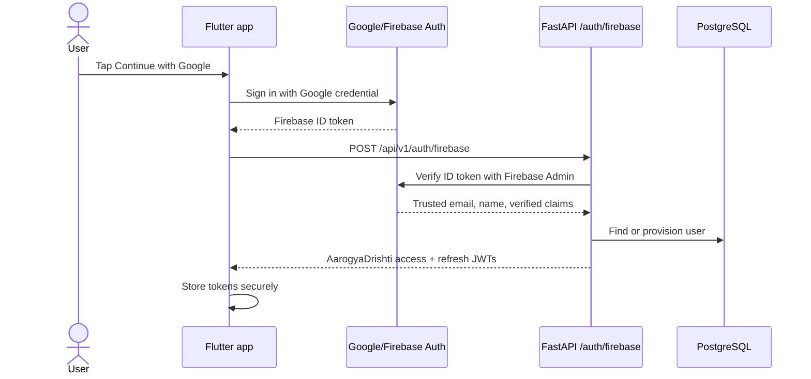
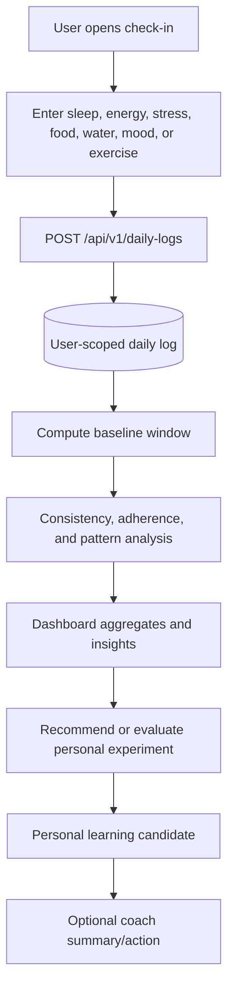
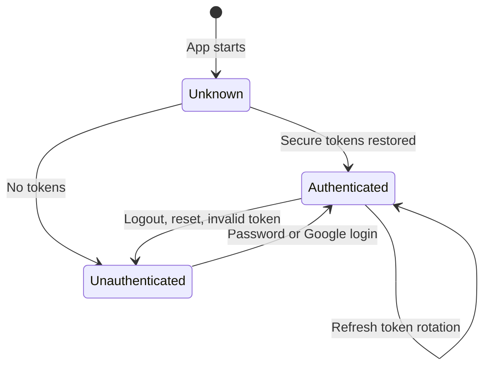
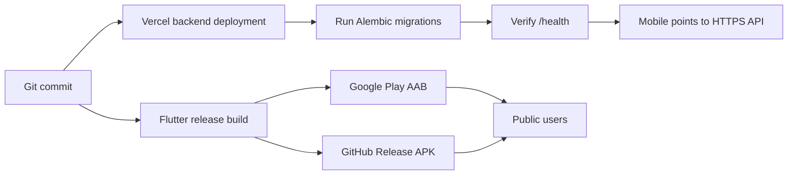

# Product and system workflows

## Google sign-in

The API accepts only a verified Firebase ID token at this exchange endpoint. All
subsequent protected requests use the app-issued bearer token.

## Daily check-in and insight flow

Unknown values remain `NULL`; the analytics layer does not convert missing data
to zero.

## Health Connect sync

1. The user grants selected Android Health Connect permissions.
2. The app reads supported observations only after consent.
3. The app sends normalized values to the API.
4. The API merges device values into the user's daily row without overwriting a
   known manual value with an unknown value.
5. Analytics recompute from the resulting user-scoped dataset.

Health Connect is best-effort. Manual tracking remains available when the
provider is unavailable or permission is denied.

## Session lifecycle

## Release flow

